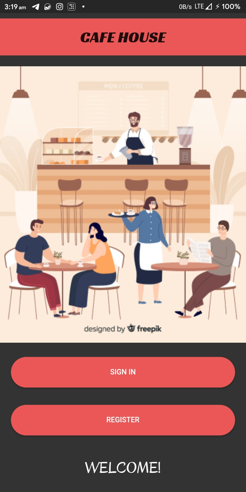
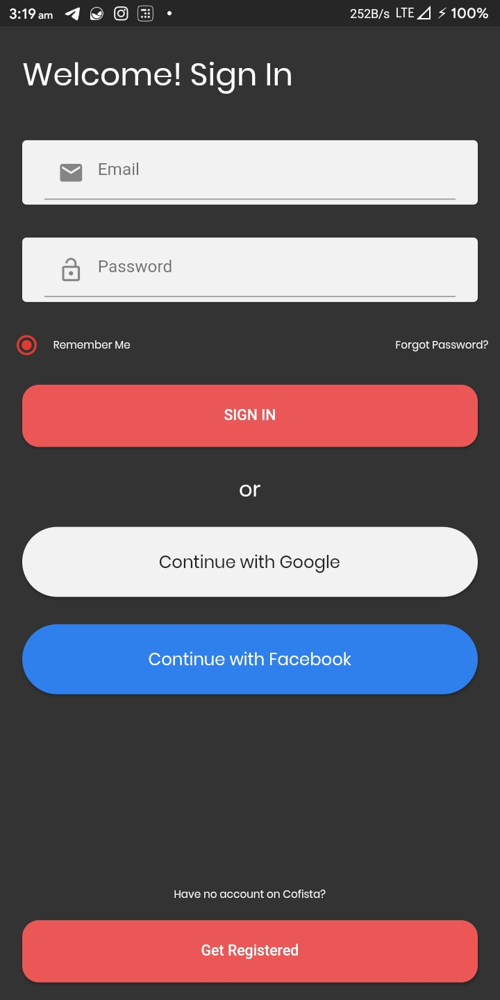
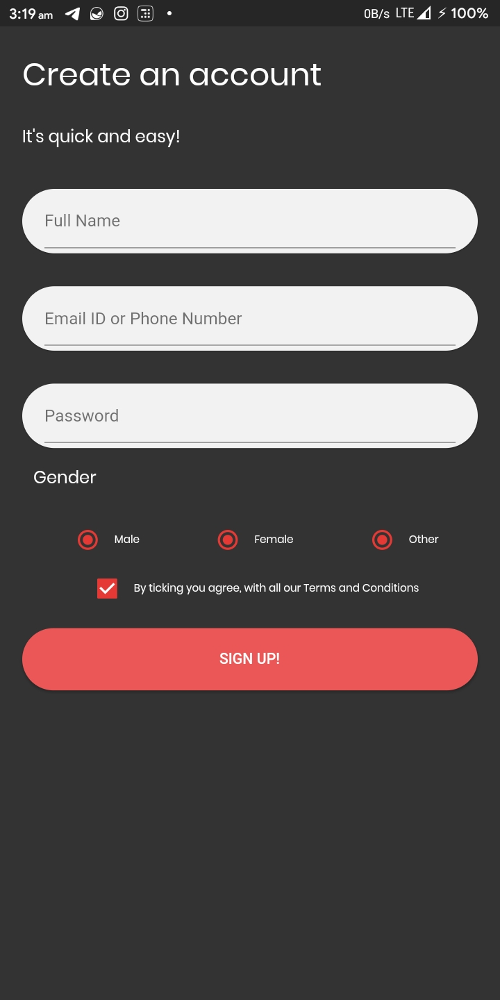
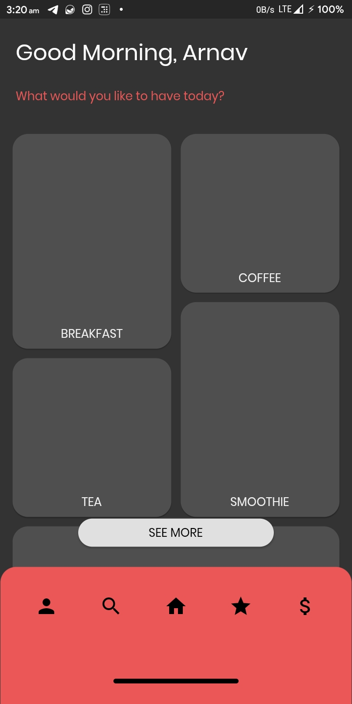
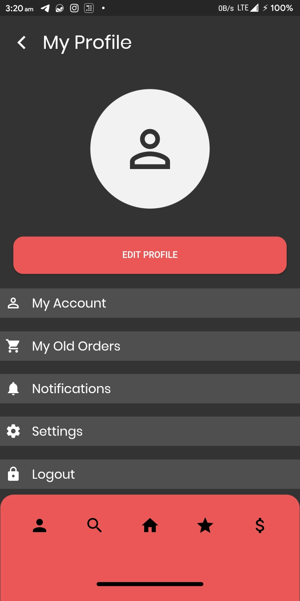
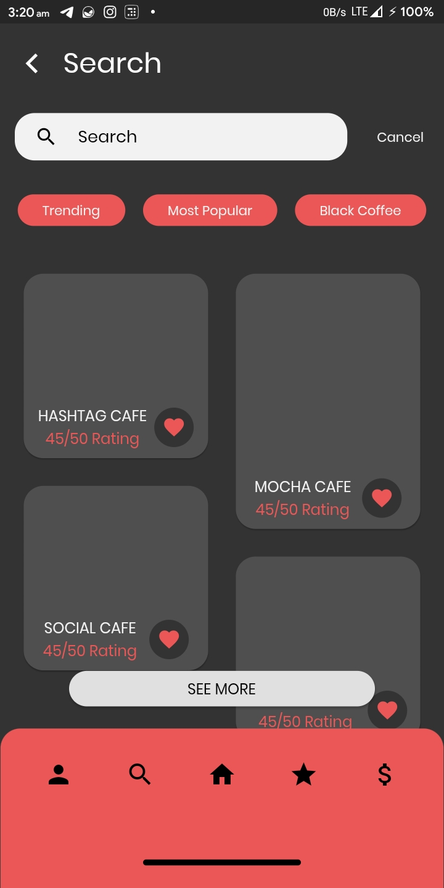
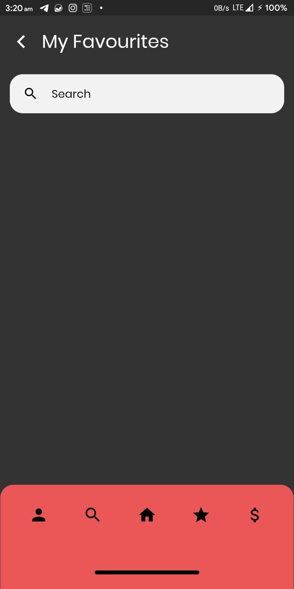
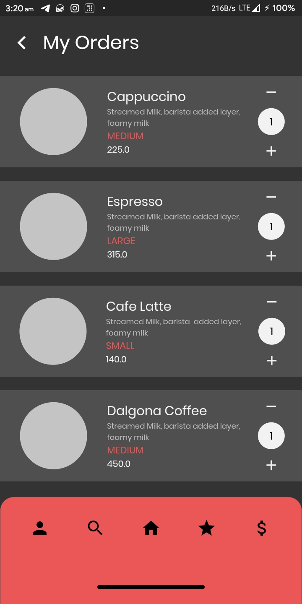

# Cofista-UI

This is a simple app UI made in Flutter for a beverage ordering app. It features simple and beautiful UI, with responsive output.

## Demo

## Dependencies
This app uses the following packages -
- `google_fonts: ^1.0.0`
- `flutter_staggered_grid_view: ^0.3.0`
- `font_awesome_flutter: ^8.8.1`

More details about these can be found in the [`pubspec.yaml`](https://github.com/codenameakshay/cofista-ui/tree/master/pubspec.yaml) file.

## Development

Start by forking the repository, and then run `flutter pub get` in the local repository. You are now ready to modify, fix, update, or remove any feature in the app. If you want, you can create pull requests, we will be happy to welcome them.
>Note: This project requires Flutter Framework to be installed on your machine.